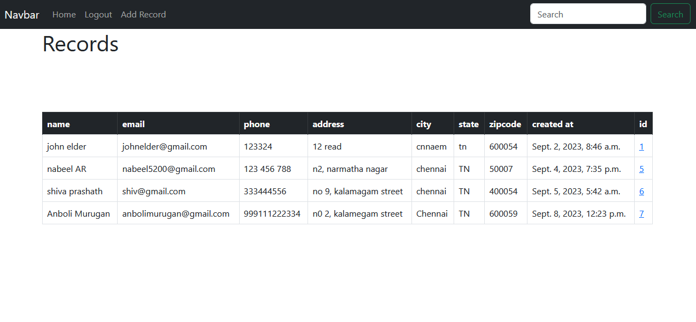
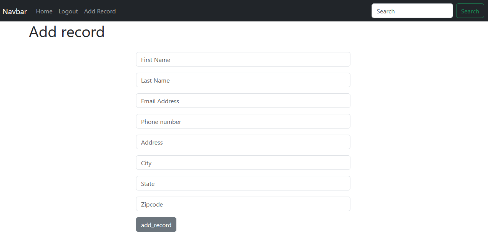

# Django CRM

Django CRM is a Customer Relationship Management app through which customer data and be added, accessed, updated and deleted.

Homepage of CRM



Adding records 


Registering User


Edit/delete Customers 


## Installation

Use the package manager [pip](https://pip.pypa.io/en/stable/) to install requirements.

```bash
pip install django
pip install mysql
pip install mysql-connecter-python
```

## Usage
```bash
#activate virtual environment
venv\Scripts\activate
```
```python
#create database
python db.py

#make migrations
python manage.py makemigrations
# apply migration to database
python manage.py migrate

# run server
python manage.py runserver
```
And voila server is up and running in localhost:8080
## Contributing

Pull requests are welcome. For major changes, please open an issue first
to discuss what you would like to change.

Please make sure to update tests as appropriate.

## License

[MIT](https://choosealicense.com/licenses/mit/)